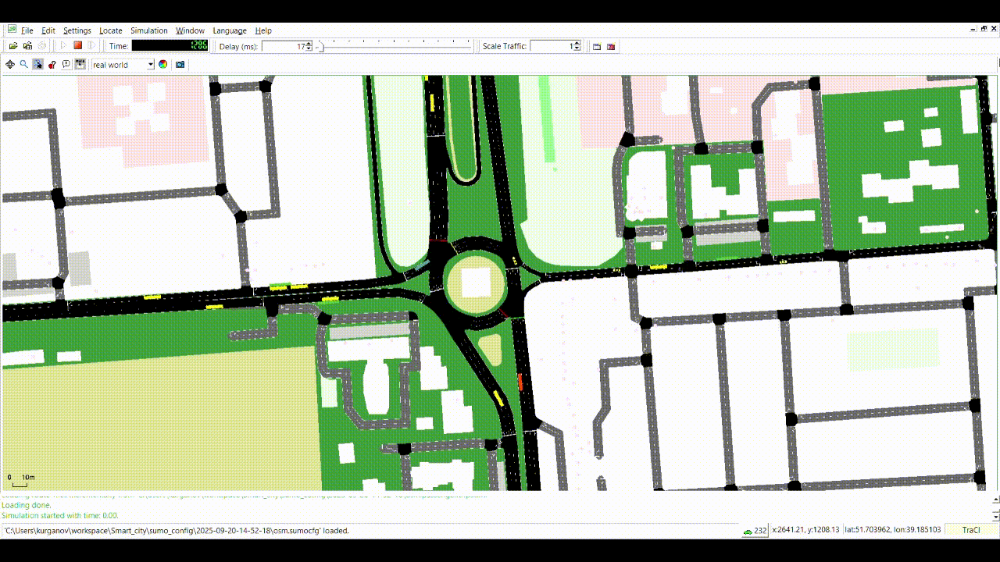

# SMART_CITY

[](https://www.python.org/)
[](https://www.eclipse.org/sumo/)

Коротко: проект для моделирования городской среды на SUMO с агентами, метриками и модулем управления авариями/препятствиями. Поддерживается запуск симуляции, обучение/тестирование агентов и визуализация результатов.

---

## Содержание
- [Ключевые возможности](#ключевые-возможности)
- [Структура проекта](#структура-проекта)
- [Установка и требования](#установка-и-требования)
- [Быстрый старт](#быстрый-старт)
- [Скрипты](#скрипты)
- [Конфигурация SUMO](#конфигурация-sumo)
- [Метрики и визуализация](#метрики-и-визуализация)
- [Разработка и тесты](#разработка-и-тесты)
- [Частые проблемы](#частые-проблемы)
- [Планы и TODO](#планы-и-todo)

---

## Пример работы GUI


---

## Ключевые возможности
- Управление авариями в SUMO в двух режимах:
  - **lane_block** — временно «закрывает» полосу (`maxSpeed=0`, настройка разрешённых классов ТС).
  - **obstacle** — спавнит неподвижное ТС и фиксирует его остановку на полосе; при невозможности спавна есть фолбэк к lane_block.
- Безопасные вызовы TraCI: проверки существования объектов, устойчивость к ошибкам, восстановление исходного состояния.
- Оценка влияния инцидентов: расчёт «impact» по рёбрам с учётом доли поражённых полос и типа инцидента.
- Ограничение одновременно активных аварий, вероятностное появление, контролируемая длительность, отступы от концов полос.
- Скрипты для запуска симуляции с/без агентов, обучения и тестирования.

---

## Структура проекта
```
SMART_CITY/
├─ agents/                   # агенты/стратегии управления трафиком
├─ metrics/                  # хранилище метрик
├─ notebooks/
│  └─ visualize_test_data.ipynb
├─ scripts/
│  ├─ utils/                 #Утилиты на libsumo
│  │  ├─ accident_utils.py   # AccidentManager и утилиты для аварий
│  │  ├─ metrics_cache.py
│  │  ├─ q_learning.py
│  │  ├─ sumo_utils.py
│  │  └─ test_utils.py
│  ├─ utils_traci/           # те же утилиты на TraCI для GUI
│  ├─ accident_bot.py
│  ├─ learn_agents.py
│  ├─ start_sim_gui.py
│  ├─ test_agents.py
│  └─ test_without_agents.py
├─ sumo_config/              # сети, маршруты и конфиги SUMO
├─ README.md
├─ pyproject.toml
├─ requirements.txt
└─ uv.lock
```

---

## Установка и требования

1) Предусловия
- Python 3.13+
- Установленный SUMO (GUI по желанию). Переменная окружения `SUMO_HOME` должна быть задана.
- Опционально: `uv` или `pip`.

2) Создание окружения и зависимости
```bash
# Вариант A: через uv (быстро)
uv venv .venv
source .venv/bin/activate  # Windows: .venv\Scripts\activate
uv pip install -r requirements.txt

# Вариант B: через pip
python -m venv .venv
source .venv/bin/activate
pip install -r requirements.txt
```

3) Настроить SUMO_HOME
```bash
# Linux/macOS
export SUMO_HOME=/path/to/sumo
# Windows (PowerShell)
$env:SUMO_HOME="C:\Program Files (x86)\Eclipse\Sumo"
```

---

## Быстрый старт

- Запуск симуляции с GUI:
```bash
python scripts/start_sim_gui.py
```

- Тестовый прогон без агентов (бэйслайн):
```bash
python scripts/test_without_agents.py
```

- Запуск/обучение агентов:
```bash
python scripts/learn_agents.py
```

- Оценка/тест агентов:
```bash
python scripts/test_agents.py
```

- Бот аварий (генерация инцидентов через геолокацию в Telegram):
```bash
python scripts/accident_bot.py
```

Примечание: пути к конфигам SUMO берутся из `sumo_config/` или параметров скриптов. Уточните/добавьте флаги при необходимости.

---

## Скрипты

| Скрипт | Назначение | Пример запуска |
|---|---|---|
| `scripts/start_sim_gui.py` | Запуск симуляции с SUMO-GUI | `python scripts/start_sim_gui.py` |
| `scripts/test_without_agents.py` | Запуск симуляции без агентов | `python scripts/test_without_agents.py` |
| `scripts/learn_agents.py` | Обучение агентов (Q-learning) | `python scripts/learn_agents.py` |
| `scripts/test_agents.py` | Тест/оценка обученных агентов | `python scripts/test_agents.py` |
| `scripts/accident_bot.py` | Демо генерации аварий/препятствий при запуске с gui | `python scripts/accident_bot.py` |

---

## Конфигурация SUMO

Положите вашу сеть (`.net.xml`), маршруты (`.rou.xml`), дополнительные файлы (`.add.xml`) в `sumo_config/`.  
Обычно требуется задать:
- главный `.sumocfg` файл,
- пути к сетям/маршрутам,
- параметры шагов симуляции и GUI.

При необходимости обновите соответствующие скрипты запуска, чтобы ссылаться на ваши конфиги.

---

## Метрики и визуализация
- Метрики накапливаются и кешируются утилитами из `scripts/utils/metrics_cache.py`.
- Для анализа результатов используйте ноутбук:
```bash
jupyter notebook notebooks/visualize_test_data.ipynb
```

---

## Частые проблемы

- SUMO не найден: проверьте `SUMO_HOME` и наличие `sumo`, `sumo-gui` в PATH.
- Ошибки TraCI: убедитесь, что версии SUMO и `traci` совместимы и симуляция запущена корректно.
- Нет маркеров/препятствий: проверьте режим `mode`, список `lane_ids` и ограничения `max_concurrent`, а также отступы и допустимые классы на полосах.
- Не запускается при использовании последней версии `Python Environments` доступной в `VSC (1.12.0)`, корректно работает на версии `1.10.0`.  

---

## Планы и TODO
- [ ] Новый скрипт с Grid Search для поиска лучших вариантов агентов.
- [ ] Дополнительные агенты/алгоритмы.